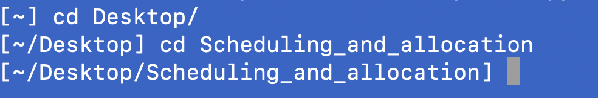

# Scheduling and Allocation Programs

A package of tools used for scheduling and allocating teachers and labs etc.


Uses Python

Takes into account the following contraints
1. Teachers
2. Labs
3. Streams
4. Limits schedules based on current Collective Agreement Rules

Files are saved in CSV format, so they can be edited manually if  you are careful enough.

## MAC OS X

## Python Installation

Go to [python site](https://www.python.org/) and navigate to the `Downloads` page


Download python.

You should see an installation program icon in your task bar 

Double click this icon, and choose all the defaults.

Once installation is complete, you should see the following 'finder' window pop-up


Double click the "update Shell" icon

### Validation

Use the search tool (Command-spacebar) open a terminal window


Type the following in the terminal window

```bash
python3 --version
```

The version number should be the same python that you installed


### Install Dependencies

Use the search tool (Command-spacebar) open a terminal window


Type the following in the terminal window

```bash
python3 -m pip install reportlab
```

```bash
python3 -m pip install pillow
```


## Application Installation

Download zip file to your Mac (it will be located in your downloads folder)


Copy this file to your Desktop (drag'n'drop, or cut'n'paste)


Double click the icon, and you will have a new icon on your desktop.  


At this point you can remove the zip file

## Running the program(s)

Use the search tool (Command-spacebar) open a terminal window


Navigate to the correct directory

```bash
cd Desktop
cd Scheduling_and_allocation
```



Run either the scheduler or allocation program

```bash
python3 SchedulerProgram.py
```


```bash
python3 AllocationManager.py
```


## MS Windows (Tested on Windows 10)

### Install Strawberry Perl

(version used .0.1-64bit - Newer versions available but have issues with Tk Package)
http://strawberryperl.com/release-notes/5.30.0.1-64bit.html


### Install required Perl Packages

Run Command Prompt as Administrator

```bash
cpan YAML
cpanm --Force Tk         # must force install Tk
cpan Text::CSV
cpan PDF::API2
```

## Alternative Installation

The above instructions assume that the software is being installed from the source on a clean machine, with no pre-existing Perl. It can alternatively be installed using a portable version of Strawberry Perl, with the required Perl packages already installed. In this context, the user works with a zipped folder containing Strawberry Perl portable, the application code, and a pair of batch scripts (one for each of the tools).

### INSTALLATION
To install the scheduler and allocation manager software on another computer, copy the folder containing these instructions onto a USB drive. Then copy it from the drive onto the computer you want to use it on.

### USE
To run the AllocationManager, double-click on the icon. To run the SchedulerManager, double-click on the icon. 


## Python Installation
The Python version of the software requires the installation of multiple packages to run. These packages include, but are not limited to:
- [python-dotenv](https://pypi.org/project/python-dotenv/) (for retrieving environment variables from a .env file)
- [pony](https://pypi.org/project/pony/) (for object-relational mapping and database access)
- [Pmw](https://pypi.org/project/Pmw/) (for creating special tk megawidgets in certain views and windows)

A full list of the required packages can be found in the file "[requirements.txt](requirements.txt)".

### Setup a Virtual Environment (Optional)
To avoid system pollution and dependency management issues, you should consider setting up a virtual environment (or venv) for the project before you install the packages below. To do so, follow these instructions:

1. Navigate to the root folder of the project.
2. In the terminal, type `python -m venv [name_of_venv]` to create your virtual environment.
3. Activate the virual environment by navigating to its folder and running an "activate" file from one of its child directories.

The specific directory and file will vary based on your operating system and command-line interface.

For PowerShell:

`[name_of_venv]\Scripts\activate.ps1`

For other Windows CLIs:

`[name_of_venv]\Scripts\activate.bat`

For Linux and Mac:

`source [name_of_venv]/bin/activate`

To exit your virtual environment once you are done, type `deactivate`.

### Installing the Packages

To install all necessary Python packages, type this command in the terminal:

`pip install -r requirements.txt`

# COPYRIGHT

Copyright (c) 2025, Sandy Bultena

Copyright (c) 2016, Jack Burns, Sandy Bultena, Ian Clement. 
