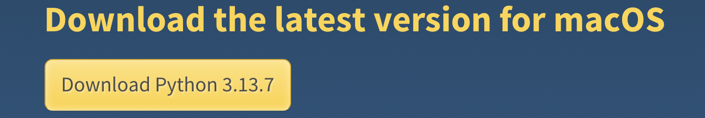
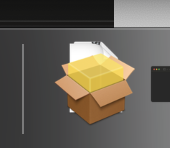
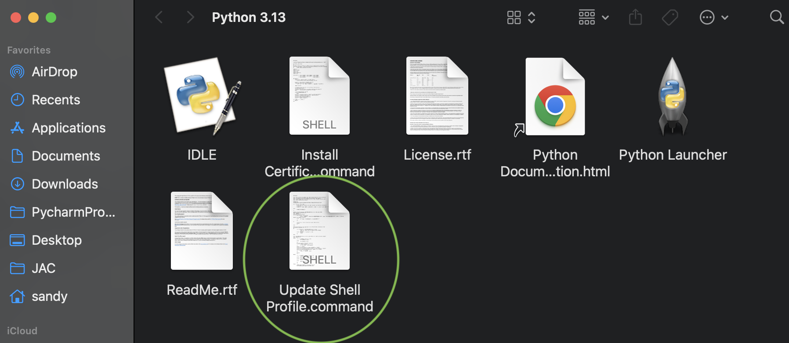
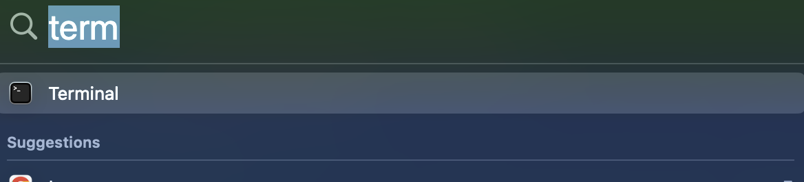
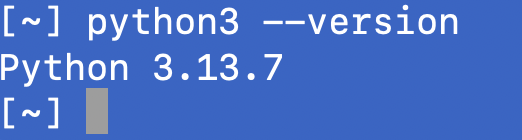

## MAC OS X

## Python Installation

Go to [python site](https://www.python.org/) and navigate to the `Downloads` page



Download python.

You should see an installation program icon in your task bar 

Double click this icon, and accept all default options.

Once installation is complete, you should see the following 'finder' window pop-up



**Double click the "update Shell" icon**

### Validation

Use the search tool (Command-spacebar) open a terminal window



Type the following in the terminal window

```bash
python3 --version
```

The version number should be the same python that you installed



## Application Installation

Use the search tool (Command-spacebar) open a terminal window


Type the following in the terminal window

```bash
python3 -m pip install scheduling_and_allocation
```

## Running the program(s)

Use the search tool (Command-spacebar) to open a terminal window

Type the following in the terminal window

```bash
Scheduler
```

or

```python
Allocation
```

