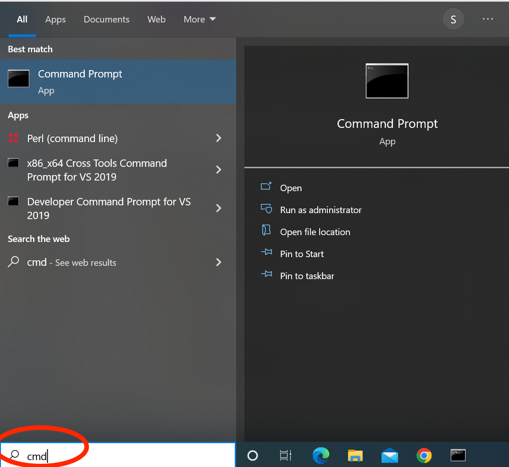

## Windows

### Python Installation

Go to [python site](https://www.python.org/) and navigate to the `Downloads` page


Follow instructions for standard install

* Select admin privileges if you have them, 
* Select `add Python to path`
* **PAY VERY CLOSE ATTENTION TO WHERE IT IS INSTALLED!!**


### Validation

Open a `cmd` window (got to windows search bar and type `cmd`)



In the command window, type `where python`


The first version of python should be the one you just installed.  

If the above does not show the version of python that you installed, modify the path by...

* Open a `cmd` window
* Type `setx "c:\Users\SandyLocal\AppData\Local\Programs\Python\Python313\python.exe;%PATH%"` **but** use the location where *you* saved the the `python.exe` file.

Validate again.

> NOTE: if the above doesn't work, all is not lost, but the easiest method is to ask your administrator to adjust the PATH environment variables on your computer to point to the correct location of python

## Application Installation

Open a `cmd` window (got to windows search bar and type `cmd`)

Type the following in the command window

```bash
python3 -m pip install scheduling_and_allocation
```

## Running the program(s)

Open a `cmd` window (got to windows search bar and type `cmd`)

Type the following in the command window

```bash
Scheduler
```

or

```python
Allocation
```

